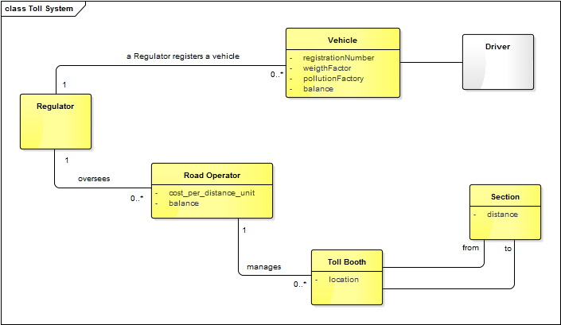
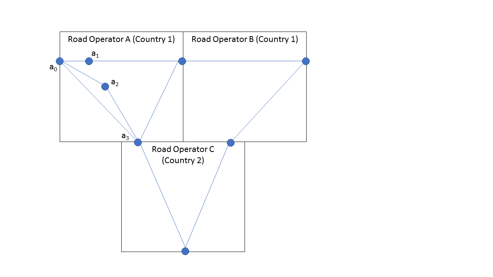
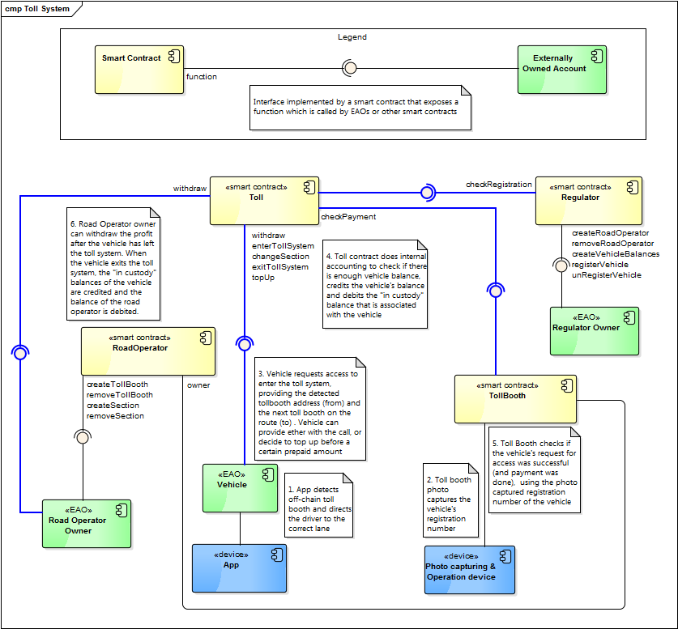
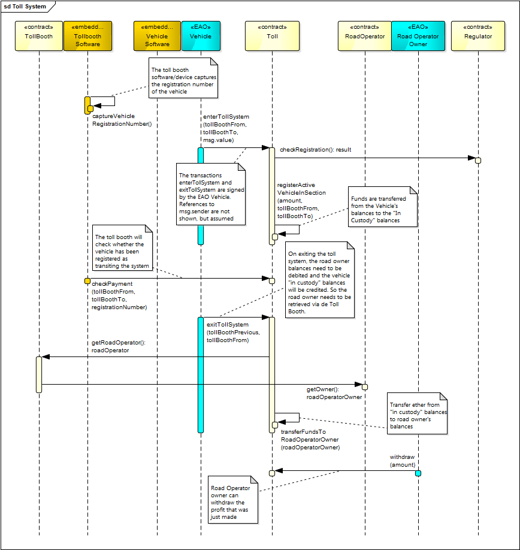
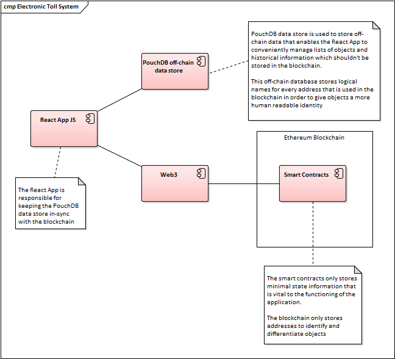

# Blockchain-based toll collection solution

&nbsp;

## Introduction

This project concerns the implementation of an electronic toll system by using a Ethereum blockchain solution. It will emphasize the shortcomings of current day implementations and present a blockchain design with an example implementation. Finally, the limitations of the chosen design are identified and a possible alternative approach is discussed.

## Current implementations

Existing electronic toll systems provide a way for users to use concessioned highways without the need to stop at each toll booth. It eliminates waiting times at those toll booths, facilitates monthly payments of bills and brings down costs for the road operators, as no operating personnel is needed. 

An ongoing trend these days is the privatization of many formerly public services. One of them is the maintenance of highways. These activities are concessioned to private road operators. This means that users have to register their vehicles with *many different road operators* who all use possible *different (delayed) payments methods* (banks, credit cards/online proprietary payment services, Paypal, etc). Additionally, crossing countries might be cumbersome as different currencies are used in combination with international payment restrictions (SWIFT transaction = huge delays and high fees). 

## Blockchain-based solution

The blockchain solution that is presented in this essay is a cryptographically secure peer-to-peer system for the electronic toll collection that allows payments to be sent directly from a vehicle to a toll system *without an intermediary, central party*. All actively involved parties (vehicles, toll booths and road operators) will be protected from double-spending and fraud. Compared to conventional electronic toll collection systems, this blockchain approach has the following advantages:

* One currency, this blockchain solution will be implemented on the Ethereum platform, using ether as the currency and thus eliminating the need for vehicles to acquire foreign currencies when crossing different road operators in different countries 
* Elimination of central payment party: Banks (for debit cards and bank transfers) and credit card companies are not needed anymore. [Transaction fees](https://ethgasstation.info) on the Ethereum network are cheap, compared to the fees that are charged by credit card companies and maintenance fees charged by banks, let alone the exorbitant high fees that are charged when doing SWIFT transactions
* One kind of payment method: The involved road operators will also use the same Ethereum platform and the same smart contracts. Conventional electronic toll systems are not unified and road operators might have different payment methods, making the administration harder for customers 

Before getting into the implementation details, let's look at the following domain model that depicts the main entities that participate and their relationships. 

### Identifying the entities in the system

Let's consider the following UML Domain Model.



A regulator oversees a number of road operators. A driver who wants to use the system, needs to register its vehicle with the regulator, communicating  the registration number, pollution and weight factor. The weight of a vehicle is important as it determines the extent in which the road will degrade over time: Heavy lorries have a detrimental effect on the state of the surface of the slowest lane of a highway and a light motorcycle doesn't really hurt too much. SUVs with big engines should pay more as they are heavy polluters. Conceptually, there is a driver, but the entity *driver* doesn't find its representation later in the implementation model as we will find out later, but it's ok to model it as an entity for clarity's sake. A cruising vehicle covers one or more sections on the highway, where each section is identified by a beginning (from) and ending toll booth (to) and thus the covered distance can be calculated. Furthermore, each road operator can tweak their cost/benefit model by adjusting the cost per distance unit. 

Vehicle/drivers will debit (=top up) a prepaid account before they enter the toll system and this prepaid account will be credited when they advance through the system.

> To debit and to credit can be confusing concepts, because it all depends on from what party you are looking at it. According to sound [accounting rules](https://www.accountingtools.com/articles/2017/5/17/debits-and-credits "accounting rules"), when you debit an asset, you are increasing the balance, and when you credit an asset, you are decreasing the balance of that asset. We will follow those rules obediently.

The fees that the vehicles pay will by kept in custody during the time that a vehicle is transiting the toll system that is managed by a certain road operator. After a vehicle has left the toll system it can choose to withdraw the left-over ether from the prepaid account or leave it, for another future trip. Vehicles can also opt for paying per trip, providing value as they send a transaction to enter the system.

Road operator owners can withdraw the profit that is related with a single trip (which can consist of one or more sections) by a vehicle only after that vehicle has left the toll system. Upon entering the toll system, fees are kept in custody until the vehicle has left the toll system. 

When a vehicle decides to go from a section that is operated by one road operator to a section that is covered by another road operator, the vehicle must first exit the system that is operated by the former, then enter the toll system that is operated by the latter. 




> How to identify the vehicle ?
> 
> Determining the identity of the vehicle is of utmost importance: We don't want a driver to register a very light electric car and then take the lorry to work and pass through the system as if he would be driving the electric car. The only way that this can be enforced is by photo capturing the registration number of the car. Another option could be to equip the cars with devices that emit a signal to the toll booths that would identify that car, but that solution would be more expensive and people could just easily switch the devices. This solution is not user-friendly either as it burdens users will the acquisition of those devices and possible malfunctions.


So, toll booths determine a vehicle by photo capturing the registration number (i.e. the license plate number) of the vehicle. The driver of a vehicle uses an App that contains a registry of all road operators and toll booths. By using voice-control, a driver can instruct the App to calculate the most optimal route to a certain destination. This route can be confirmed by the driver and the route it stored, along with the toll booths that will be passed along the route. When a vehicle approaches a toll booth that has more than one possible divergent sections (for example, the sections a<sub>0</sub>-a<sub>3</sub> and a<sub>0</sub>-a<sub>1</sub>) in the above example route layout, the App will indicate which lane the vehicle should take. 

When a vehicle is registered, two pieces of information are stored: the address of the vehicle and the registration number. After the vehicle has chosen the correct lane, *the vehicle requests access to the toll system* providing the current toll booth and the toll booth that is the next toll booth on the route to the destination. Subsequently, *a toll booth checks whether a vehicle has been granted access* (=has paid) by providing the photo captured registration number when making the call to check. It's easy to see that, in this implementation, the *vehicle* is the entity that requests access by providing implicitly its address and that the toll booth checks if the access was granted by using the registration number. The toll system will see if there is a match between the registration number sent by the toll booth and the address sent by the vehicle. In this implementation, both the entity vehicle* and the entity toll booth are actively involved in the process. Other implementations might have the toll booth take care of both responsibilities. Of course, dividing responsibilities between the toll booth and the vehicle has consequences for the design, which makes things more interesting and which will be pinpointed in the next paragraphs. Let's move on to the implementation view of the system. 

### Component Model
We will now convert entities in the domain model to either smart contracts or externally owned accounts. Although smart contracts in Solidity resemble classes and the most obvious way of modeling would be a Class Diagram, a smart contract is also a unit of deployment, so the UML Component Model seems to be a good fit to model these smart contracts and EAOs. Let's take a look at the following diagram.
 



* `Regulator`. The `Regulator` smart contract will have the following functions
    * `createRoadOperator`: Creates a new instance of a `RoadOperator` smart contract and will transfer ownership to the road operator owner EAO
    * `removeRoadOperator`: Removes the instance of a `RoadOperator` smart contract and the remaining funds will be send to the road operator owner EAO 
    * `registerVehicle`: Registers a vehicle with the `Regulator` smart contract. This transaction is signed by the regulator owner EAO. One could opt for having a `Vehicle` register itself, but there is still a piece of off-chain information that needs to be checked by the `Regulator`: The registration number, the pollution factor and the weight factor. A `Vehicle` cannot just say: "I want to register myself and this is my registration number, my pollution and weight factor", verification is needed here, *still*
    * `unRegisterVehicle`: Unregisters a vehicle from the `Regulator` smart contract, also signed by the regulator owner EAO when services are not needed anymore
* `Toll`. This smart contract will contain the vehicle balances (that will be debited by the `Vehicle` when they top up the balance) and the road operator balances that are being credited by road operator owners when they withdraw the profit. The existence of a separate smart contract is justified by the fact that balances cannot be maintained by road operators, as it would be a cumbersome activity to manage each time a section is covered where different road operators are crossed, it would invalidate a big advantage of this blockchain-based solution. Also, ethically it's not completely correct for a regulator to maintain balances of vehicles. Finally, the `Toll` smart contract also contains the "in custody" balances which are the balances that are being debited by the `Vehicle` when the vehicle enters the toll system (or changes sections). At the moment when the `Vehicle` exits the toll system, the road operator owner can credit the "in custody" balances (withdraw the profit).   
* `RoadOperator`. A road operator smart contract manages toll booths and sections. It can set the cost per distance unit, so that the profits can be adjusted according to market conditions. This smart contract is owned by a road operator owner. A road operator owner can collect fees from the `Toll` smart contract. This smart contract will have the following responsibilities:
	* Adding and removing sections. A section consists of a *from* and a *to* toll booth
    * Adding and removing `TollBooth` smart contracts
* `TollBooth`. A tiny smart contract that contains a location and a reference to the `RoadOperator` smart contract. The location is used to calculate the distance covered by a `Vehicle` and thus the cost of transiting the section. The reference to the `RoadOperator` is used to determine the owner of the `RoadOperator` smart contract in order to deposit funds to "in custody" balances that are registered on the name of the Road Operator owner on entrance of a `Vehicle` to the toll system. An off-chain device (software) is being used to check whether a passing `Vehicle` has paid enough ether to enter the section. It will use the TollBooth's (from) address, the address of the next toll booth (to) and the registration number of the `Vehicle` when calling the function `checkPayment` on the `Toll` smart contract
* `Vehicle`. A registered vehicle can deposit ether in the `Toll` smart contract. The balance that is available for a certain vehicle is checked every time a vehicle passes a toll booth. *A `Vehicle` will communicate directly with the `Toll` smart contract*. It will call either the function `enterTollSystem` or `changeSection`, depending on whether the `Vehicle` wants to enter the system or change from one section to the other. A `Vehicle` cannot only deposit prepaid ether, but can also opt to send ether with each transaction to `enterTollSystem` or `changeSection`. These functions will deposit the ether directly to the vehicle's balances in the `Toll` smart contract

### Sequence diagram

In the UML component model, some comments were added that indicate a sequence of activities which form a use-case scenario. This use-case scenario will be formalized in this section and a UML Sequence diagram will be used to show how smart contract instances and/or EAOs send messages to other smart contract instances. 



It can be deduced from the sequence diagram that balances are first placed into custody when entering the toll system. After a vehicle has been registered as having paid, the toll booth software can query the `Toll` smart contract to check whether physical access to the toll system should be granted.   

As can be seen, the function call `checkPayment` and the function call `enterTollSystem` are not initiated by the same actor. As a result, the function call to `checkPayment` might result in `false` if the network is congested. In that case, one or more extra calls must be made until a positive result is retrieved. 


> In order to circumvent this situation, the toll booth software should listen to an event, let's name it `EnteredTollSystem` which is written to the the blockchain by the `Toll` smart contract and which  indicates that a specific vehicle has been granted access to the toll system. The `checkPayment` function can then be used as a callback function and will be executed when the toll booth software detects the event `EnteredTollSystem`.   

Still, the Road Operator owner won't be able to retrieve the profit. Only after the vehicle has left the toll system (after having covered one or more sections), the funds that were placed into custody, are being transferred to the road operator owner balances in the `Toll` smart contract. At that moment, the road operator owner can withdraw the funds.

### Implementation limitations

From the moment that the vehicle sends the transaction to request entrance to the toll system, to the moment that the toll booth receives an answer from the toll system (whether physical access should be granted to the system), it takes [an average time of 15 seconds](https://etherscan.io/chart/blocktime) (Ethereum block time). What would be a very bad user experience is that the driver of the vehicle arrived at the barrier and had to wait there for a few seconds just because we have chosen a blockchain approach. So the App that the driver uses should send a transaction to the toll system in time, to prevent the driver from waiting at the barrier. 

But on the other hand, as described in the design, the driver will be able to determine a route that covers several sections (voice-controlled hands-free of course). At the moment that the driver confirms the trip, the App could fire all necessary transactions to pay for the sections before the vehicle arrives at the toll booths, so avoiding possible wait-times. This App could turn out to be really useful!

Attention needs to be paid to the physical design of the toll booth and surrounding lanes and constructions. Let's say that a vehicle has setup a trip that consists of several sections and has already paid for the sections. It should be absolutely clear for the vehicle what lanes it should choose because it could lead to congestion at the toll booths when a vehicle arrives at toll booth that diverges to  two or more different sections, and the  the driver finds himself at a barrier that won't lift because it was just not the right lane! This could get nasty and confusing and these off-chain, physical design implications need to be considered as well when implementing this blockchain approach. 

Another paradoxical situation needs to be addressed, which arises out of an aspect that was actually brought forward an an advantage of this blockchain solution: The usage of a currency that allows for payments across different countries and which eliminates the needs for central payment companies. But we cannot ignore the fact that cryptocurrencies prices are not stable at the moment and prices are subject to great fluctuations. People that use the system are not here to speculate with the price, neither are road operators. So a way needs to be found which circumvents these situations. [Oracles](https://bravenewcoin.com/services/oracles/daily-price-oracles) can come into play handily as a way of hedging price fluctuations by calculating the amount of ether that needs to paid while calculated costs are pegged to a stable conventional currency. 

The approach that was described in the design, let's name it "*Power to the Vehicle*", was based on the decision, that the responsibilities of requesting access to the system and the check whether the access was granted, is divided over the actors *vehicle* and *toll booth*. But what if we would change that? What if the vehicle was just a passive object that just puts ether in a balance and asks the toll booth to send the transaction to request access to the toll system on behalf of the vehicle, would that change anything ? We will take a look at that approach in the next paragraph, that approach will be named: "*In the Toll Booth, we trust*".

### An alternative approach

If we give the toll booth the task to request access to the toll system on behalf of the vehicle, the toll booth will have to communicate a hashed secret on behalf of the vehicle. The vehicle sends a transaction to the toll booth with the hash, then the toll booth will call the `enterTollSystem` function, sending along the hashed secret. If the vehicle has enough ether, the amount of ether that corresponds with the section will be put in custody. In this approach, the `enterTollsystem` transaction can return a value that indicates success or a failure to grant access. Consequently, the toll booth can grant physical access to the toll system immediately, there is no synchronization issue! Then later, when the vehicle leaves the toll system, the vehicle sends a transaction to the toll booth with the secret in *clear text*. Only when the toll system verifies that the hashed secret and the clear text secret boil down to the same thing, will the road operator owner be able to withdraw the funds that were held in custody. Also, only then will the barrier be opened and the vehicle can leave the toll system. So the mechanism of requesting access and checking the access is reduced to one step, eliminating the need to synchronize these actions, as was the case with the other approach. The complexity of approach "*In the Toll Booth, we trust*", is found in the more obfuscated handling of secrets, although this mechanism is used in many blockchain smart contracts. 

### Implementation 

This repository contains the smart contracts, web application and test cases that pertain to the implementation of an electronic toll system by using a Ethereum blockchain.

#### Architecture
The following component diagram depicts the architecture of the system




An off-chain data store (PouchDB) is used to:

* Translate blockchain addresses to meaningful logical names
* Store historical data
* Manage lists of objects which are hard to maintain in a Solidity

The web application will be responsible for keeping the blockchain state and the off-chain data store in-sync

#### Deploying the smart contracts
Deploy the smart contracts by issuing the following command in the ```ivo_willemsen-code``` directory:
```
truffle deploy
```

#### Installation of the web application
Perform the following instructions to install the application:
  
```
npm install
```

#### Running the application
First, bring up ganache:

```
ganache-cli -a 10 -g 15000 -l 150000000000000000 -h 0.0.0.0
```

... then navigate to the following URL:
```
http://localhost:3000
```
... play around!